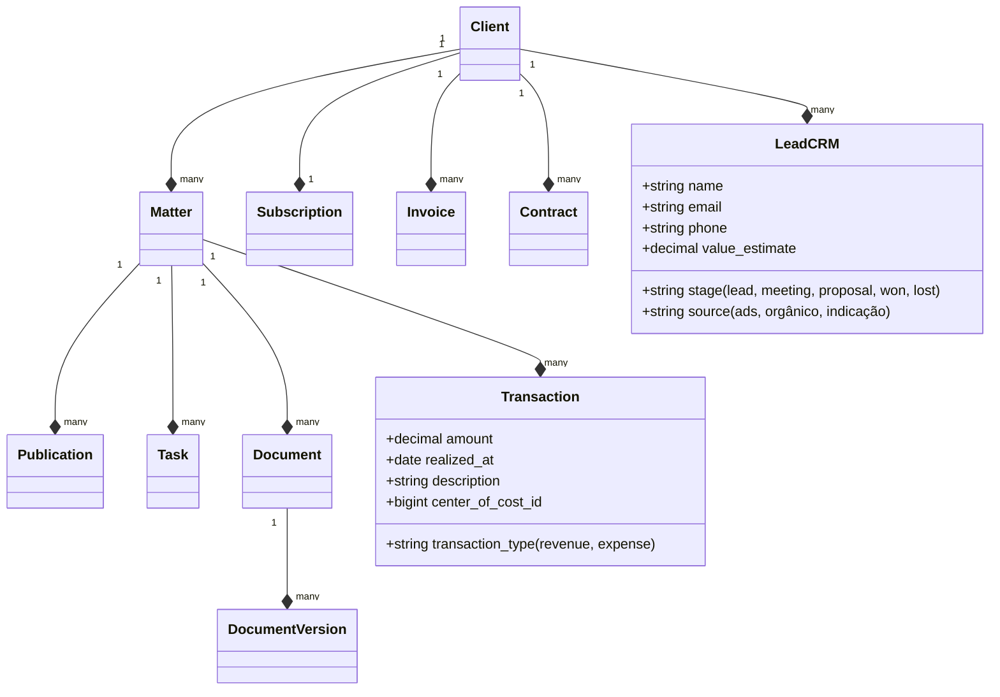

# Diagnóstico de Features & PDR Técnico — Padrão ADVBOX & B1Legal

Este documento transcreve e analisa as funcionalidades extraídas da captura de planos do **ADVBOX** e **B1Legal**, detalhando o diagnóstico comparativo da nossa plataforma atual (Fases 0 a 7), mapeando o que precisamos implementar localmente (sem depender de integrações externas complexas por hora), a arquitetura técnica de banco de dados, fluxos de trabalho e requisitos de UI/UX sob a estética modernista **Swiss Style (Bordas Rígidas / Cantos Quadrados)**.

---

## 1. Transcrição & Mapeamento de Features da ADVBOX

Abaixo estão catalogadas as funcionalidades do ADVBOX passíveis de implementação nativa na plataforma da ADVINI:

### Módulo A: Gestão de Tarefas, Prazos & Fluxos
*   **Quadro Kanban & Workflow de Tarefas**: Divisão visual de demandas e tarefas operacionais por time e processo.
*   **Controle de Produtividade do Escritório**: Dashboard com tempo de entrega, tarefas cumpridas em dia (D-0, D-1) e pendências em atraso.
*   **IA de Próxima Tarefa**: Lógica interna sugerindo a próxima ação lógica baseada no rito da fase processual atual.
*   **Agenda Unificada**: Calendário centralizado de audiências, prazos fatais e compromissos operacionais.
*   **Workflow Automático de Etapas**: Disparos de tarefas automáticas para a equipe interna toda vez que o processo muda de fase (ex: ao ir para "sentenca", gerar tarefa "analisar recurso").

### Módulo B: Controle de Clientes & CRM
*   **Origem dos Clientes (Prospecção)**: Rastreamento do canal de entrada do lead (tráfego pago, indicação, orgânico).
*   **CRM de Vendas Jurídicas**: Funil de prospecção de contratos com etapas (Lead, Reunião Agendada, Proposta Enviada, Fechado/Perdido).
*   **Aniversariantes do Mês**: Alertas automáticos no painel do backoffice para aproximar o relacionamento com os clientes.
*   **Análise Inteligente de Carteira**: Gráficos exibindo a divisão de clientes por cidade, faturamento médio e áreas de interesse.

### Módulo C: Gestão Processual Avançada
*   **Controle de Processos Estagnados**: Sistema de alertas apontando processos que não sofrem movimentação ou notas de alteração há mais de 120 dias.
*   **Contingenciamento de Processos**: Cadastro de probabilidade de êxito (Provável, Possível, Remota) e provisionamento de valores de condenação.
*   **Histórico de Tempos Processuais**: Cronômetro e estatísticas de tempo médio que um processo leva em cada fase jurídica (Cuiabá vs. Outras Comarcas).
*   **Controle de Estoque de Processos**: Volume de processos ativos em carteira divididos por classe de ação e foro.

### Módulo D: Gestão Financeira & Faturamento
*   **Controle de Inadimplência**: Alertas no painel administrativo apontando clientes com boletos/Pix em atraso há mais de 5 dias e suspensão automática de serviços de assessoria.
*   **DRE & DFC Simplificados**: Fluxo de caixa categorizado por centros de custo e plano de contas para exibir receitas, despesas e margem do escritório.
*   **Controle Financeiro por Processo**: Lançamento de custas processuais, taxas e honorários de sucumbência associados diretamente a uma pasta.

### Módulo E: Editor & Versionamento de Documentos
*   **Cadastro Ilimitado de Modelos**: Biblioteca interna de petições estruturadas, procurações e contratos padrão.
*   **Gerador de Documentos com Preenchimento**: Automatização que mescla dados cadastrais do cliente/processo no modelo de texto gerando o documento final.
*   **Editor de Documentos Integrado**: Visualizador e editor de texto rico online vinculado diretamente à pasta do processo.

---

## 2. Análise Comparativa: O Que Temos vs. O Que Precisamos

| Módulo / Feature | Como Está Hoje (Fase 7) | O Que Precisamos Fazer | Abordagem de Implementação |
| :--- | :--- | :--- | :--- |
| **Kanban de Processos** | Já temos Kanban no backoffice (ActiveAdmin) e horizontal no Portal do Cliente. | Implementar Kanban de **Tarefas Operacionais** no backoffice. | Adicionar coluna `status` (todo, doing, done) em `Task` e criar view Kanban no ActiveAdmin. |
| **CRM / Prospecção** | Modelos básicos criados na fundação. | Criar funil de vendas (Leads) com painel visual de prospecção. | Adicionar model `Opportunity` com status de funil e view interativa. |
| **Controle Financeiro** | Temos `Invoice` (Faturas), `Subscription` (Planos) no banco e expostos no Portal. | Adicionar tabelas de despesas e categorias de fluxo de caixa para DRE/DFC. | Criar model `Transaction` (polimórfica: entrada/saída) ligada a `Account` e `CenterOfCost`. |
| **Editor de Documentos** | Upload e versionamento do Active Storage integrados. | Criar gerador de minutas dinâmico mesclando dados da base. | Injetar campos variáveis em templates (ex: `Liquid` templates) e renderizar PDFs usando a gem `Prawn` ou `WickedPDF`. |
| **Processos Estagnados** | Não implementado. | Alertas automatizados para casos sem movimentação há 120 dias. | Scope Rails em `Matter` usando a data de última movimentação registrada no `MatterEvent` / `MatterClientUpdate`. |

---

## 3. Requisitos de Interface (Style UI/UX — Swiss Style)

Para manter a consistência da plataforma, todas as novas telas no frontend e backend devem respeitar as diretrizes modernistas e geométricas do **Design Suíço**:

1.  **Grade Assimétrica de Alta Rigidez**:
    *   Uso de colunas geométricas claras.
    *   Espaçamento uniforme sem decorações arredondadas.
2.  **Bordas Quadradas Sólidas**:
    *   `border-radius: 0px` absoluto em botões, campos de texto, tabelas, modais e cartões.
    *   Borda preta ou cinza sólida de `2px` delimitando todos os componentes para contraste plano.
3.  **Tipografia Forte e Funcional**:
    *   Sans-serif marcante (`Outfit` para chamadas/valores, `Inter` para relatórios).
    *   Contraste de tamanho tipográfico agressivo para hierarquia visual.
4.  **Cores Sólidas Planas (Flat)**:
    *   Fundo totalmente branco ou cinza claro neutro.
    *   Preto puro e Dourado de prestígio (`#d4af37`) como únicas cores de sotaque e status.
    *   Sem sombras esfocadas; ao fazer hover, o card muda de cor de borda de forma sólida imediata ou ganha um deslocamento geométrico em bloco.

---

## 4. PDR Técnico (Product Design Requirement)

### Arquitetura de Banco de Dados Expandida



### Especificações Técnicas de Backend (Rails 8.0)

1.  **Lógica de Tarefas Automáticas via Observers/Callbacks**:
    *   Adicionar callback `after_update` em `Matter` para que toda vez que a `current_phase` for alterada, dispare um serviço `TriggerWorkflowTasks.call(matter)` gerando as tarefas padrões da nova fase configuradas na tabela de templates do escritório.
2.  **Geração e Preenchimento de Documentos**:
    *   Criar model `DocumentTemplate` (titulo, body_html com tags `{{nome_cliente}}`, `{{processo_cnj}}`).
    *   Serviço `MergeDocument.call(template, client, matter)` para substituir as variáveis no texto e salvar um novo registro de `Document` com anexo em PDF.
3.  **Filtro de Processos Parados (Alertas de Inatividade)**:
    *   Escopo no model `Matter`:
      ```ruby
      scope :stagnant, -> {
        joins("LEFT JOIN matter_events ON matter_events.matter_id = matters.id")
        .group("matters.id")
        .having("MAX(matter_events.created_at) < ? OR (MAX(matter_events.created_at) IS NULL AND matters.created_at < ?)", 120.days.ago, 120.days.ago)
      }
      ```

### Especificações Técnicas de Frontend (Next.js 16)

1.  **Formulários de Prospecção / Cadastro**:
    *   Input fields estruturados com validação HTML nativa, bordas quadradas de 2px e foco visual sem arredondamento.
2.  **Painel de Faturamento (ADVBOX Style)**:
    *   Grade em duas colunas. Coluna esquerda: Histórico de faturas com indicador de status colorido sólido (Verde/Amarelo). Coluna direita: Detalhes da assinatura com botão "Alterar Plano".
3.  **Dropdown de Abas Responsivo**:
    *   Select selectores geométricos que no mobile e desktop evitam quebra de layout por excesso de itens laterais.
